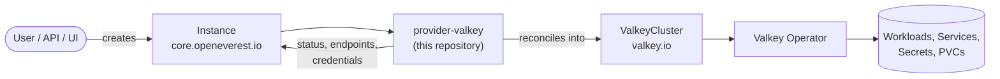

# Valkey Provider

[](https://github.com/openeverest/provider-valkey/actions/workflows/build.yaml)
[](https://pkg.go.dev/github.com/openeverest/provider-valkey)
[](LICENSE)

Run **[Valkey](https://valkey.io)** on Kubernetes through
[OpenEverest](https://github.com/openeverest/openeverest), backed by the
[Valkey Operator](https://github.com/valkey-io/valkey-operator).

## What this is

OpenEverest providers translate a single, technology-agnostic `Instance` custom resource into
the native custom resources of an upstream Kubernetes operator — for databases, but equally
for caches, message queues, object storage, or model-serving runtimes. This repository is the
provider for **Valkey**: it owns the technology-specific knowledge — topologies, versions,
parameters — so that users, the API server, and the UI stay technology-agnostic.

> [!IMPORTANT]
> **This provider is not standalone.** It requires an OpenEverest installation (core CRDs and
> controller) in the cluster. Installing this chart on its own does nothing.
> See [Install OpenEverest](https://openeverest.io/documentation/current/quick-install.html).



The provider watches `Instance` resources whose `spec.providerRef.name` is `valkey`, and
reports workload health back onto `Instance.status`. It never manages pods directly — all
lifecycle work is delegated to the operator.

## Compatibility

| provider-valkey | OpenEverest | Valkey Operator | Kubernetes |
|---|---|---|---|
| `0.1.3` | `>= 2.0.0` | `0.4.x` | `1.30` – `1.34` |

## Capabilities

| Capability | Status | Notes |
|---|---|---|
| Provisioning | ✅ | |
| Horizontal scaling | ✅ | `spec.components.engine.replicas`; shard count via the `cluster` topology |
| Vertical scaling (CPU / memory) | ✅ | `spec.components.engine.resources` |
| Version upgrades | ✅ | change `spec.version`; see [Versions](#versions) |
| Custom configuration | ✅ | pass-through `config` map on the engine component |
| Monitoring | ✅ | Prometheus exporter, via the optional `monitoring` component |
| TLS | ❌ | operator-managed; not exposed through the Instance API |

Stateful workloads additionally report:

| Capability | Status | Notes |
|---|---|---|
| Persistent storage | ✅ | `spec.components.engine.storage` (omit it for a cache-only, in-memory deployment) |
| Storage expansion | ✅ | when the StorageClass allows volume expansion |
| Backups (on demand) | ❌ | planned |
| Backups (scheduled) | ❌ | planned |
| Point-in-time recovery | ❌ | planned |
| Restore | ❌ | planned |

## Installation

The provider chart is published as an OCI artifact:

```bash
helm install provider-valkey \
  oci://ghcr.io/openeverest/charts/provider-valkey \
  --version 0.1.3 \
  --namespace everest-system
```

- The Valkey Operator is bundled as a chart dependency and installed by default. Set
  `operator.enabled=false` when the cluster already runs it.

Upgrade and uninstall:

```bash
helm upgrade provider-valkey oci://ghcr.io/openeverest/charts/provider-valkey --version 0.1.3
helm uninstall provider-valkey --namespace everest-system
```

Uninstalling the chart does **not** delete running `Instance` resources or their data.

## Usage

Verify that the provider registered itself:

```bash
kubectl get providers.core.openeverest.io valkey
```

Create an instance:

```yaml
apiVersion: core.openeverest.io/v1alpha1
kind: Instance
metadata:
  name: my-instance
spec:
  providerRef:
    name: valkey
  components:
    engine:
      type: valkey
      replicas: 3
      resources:
        requests:
          cpu: 500m
          memory: 1G
      storage:
        size: 10Gi
```

Component names are defined by this provider — see [definition/provider.yaml](definition/provider.yaml).
`spec.version` and `spec.topology` are optional; the provider defaults apply.
More examples live in [examples/](examples/).

Watch it come up and read the connection details:

```bash
kubectl get instance my-instance -w
kubectl get instance my-instance -o jsonpath='{.status.connection}'
```

Credentials are in the secret named by `.status.connection.credentialsSecretRef`.

## Topologies

<!-- BEGIN GENERATED: topologies -->
| Topology | Default | Description |
|---|---|---|
| `replication` | ✅ | Primary with replicas — a single keyspace, no sharding |
| `cluster` | | Sharded Valkey Cluster; shard count via the topology's `numShards` parameter |
<!-- END GENERATED: topologies -->

The `monitoring` component is optional in both topologies.

## Versions

<!-- BEGIN GENERATED: versions -->
| Version bundle | Default | valkey | exporter |
|---|---|---|---|
| `9.0` | ✅ | `9.0.0` | `1.80.0` |
| `8.1` | | `8.1.1` | `1.80.0` |
<!-- END GENERATED: versions -->

Source of truth: [definition/versions.yaml](definition/versions.yaml).

## Configuration

- **Chart values:** [charts/provider-valkey/values.yaml](charts/provider-valkey/values.yaml)
- **Instance parameters:** per-component and per-topology `parameters` schemas, defined under
  [definition/](definition/) and published on the `Provider` resource
  (`kubectl get provider valkey -o yaml`). The API server and the UI validate user input
  against these schemas.

The technology-specific knobs worth knowing about:

| Parameter | Applies to | Purpose |
|---|---|---|
| `config` | `engine` | Valkey configuration passed through verbatim (e.g. `maxmemory`, `maxmemory-policy`). Operator-managed keys such as port, TLS and ACL settings are ignored |
| `numShards` | `cluster` topology | Number of shards to provision |

## Development

Requires Go (see [go.mod](go.mod)), Docker, Helm, kubectl, and a Kubernetes cluster you can
reach. For local development we recommend [k3d](https://k3d.io) — `make dev-up` creates the
cluster for you.

```bash
make dev-up             # local k3d cluster + Tilt dev environment
make generate           # RBAC, provider spec, Helm chart sync
make run                # run the provider locally against the cluster
make test               # unit tests
make test-integration   # chainsaw suites under test/integration/
make dev-down
```

To work against a cluster you already have — kind, GKE, a shared dev cluster — skip
`make dev-up` and point Tilt at it:

```bash
cp dev/.env.example dev/.env   # set K8S_CONTEXT, and DOCKER_REGISTRY_URL for a remote registry
tilt up -f dev/Tiltfile
```

`make help` lists every target. `make verify` fails when generated files are stale — run
`make generate` and commit the result.

The provider contract (`Validate` / `Sync` / `Status` / `Cleanup`), RBAC markers, watches,
and code generation are documented once for all providers in
[PROVIDER_DEVELOPMENT.md](https://github.com/openeverest/provider-sdk/blob/main/PROVIDER_DEVELOPMENT.md).

### Layout

| Path | Purpose |
|---|---|
| `cmd/provider/` | Entry point |
| `internal/provider/` | `ProviderInterface` implementation, RBAC markers |
| `internal/common/` | Component name constants |
| `definition/` | Provider identity, component types, versions, topologies |
| `charts/provider-valkey/` | Helm chart (`generated/` is produced by `make generate`) |
| `config/rbac/role.yaml` | Generated `ClusterRole` — do not edit |
| `test/integration/` | Chainsaw suites: `replication`, `cluster` |
| `test/vars.sh` | Pinned operator and workload versions used by tests |
| `examples/` | Example `Instance` resources |
| `dev/` | Tilt dev environment, `.env` configuration, k3d cluster config |
| `hack/` | Helper scripts used by the Makefile |
| `.github/workflows/` | CI: lint, build, unit and integration tests, release |

### Testing

- **Unit tests** — `make test`.
- **Integration tests** — chainsaw suites under [test/integration/](test/integration/), one
  per topology.
- **CI** — [.github/workflows/build.yaml](.github/workflows/build.yaml) and
  [.github/workflows/test.yaml](.github/workflows/test.yaml) run lint, build, unit tests,
  generated-file verification, Helm lint, and each integration suite on every pull request.

## Troubleshooting

```bash
kubectl logs -n everest-system deploy/provider-valkey -f
```

| Symptom | Where to look |
|---|---|
| `Instance` stuck in `Creating` | `kubectl describe instance <name>` conditions, then the provider logs |
| No `Provider` resource in the cluster | Is the chart installed? Check the provider deployment logs |
| `Instance` ignored entirely | `spec.providerRef.name` must be `valkey` |
| `ValkeyCluster` created but no pods | Inspect the `ValkeyCluster` status — the failure is upstream in the operator |
| Custom `config` keys have no effect | Operator-managed keys (port, TLS, ACL) are deliberately ignored |

## Contributing

Issues and pull requests are welcome. See
[PROVIDER_DEVELOPMENT.md](https://github.com/openeverest/provider-sdk/blob/main/PROVIDER_DEVELOPMENT.md)
and the [OpenEverest Code of Conduct](https://github.com/openeverest/openeverest/blob/main/CODE_OF_CONDUCT.md).

## Security

Report vulnerabilities per the
[OpenEverest security policy](https://github.com/openeverest/openeverest/blob/main/SECURITY.md).
Please do not open public issues for security reports.

## License

Apache License 2.0 — see [LICENSE](LICENSE) for details.
