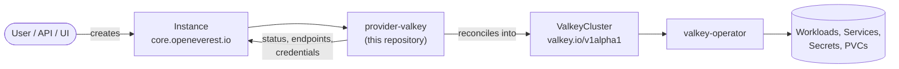

# provider-valkey

> [!WARNING]
> **Pre-alpha.** OpenEverest v2 and this provider are under active development. CRD schemas,
> chart values and defaults change frequently, including in breaking ways, and there is no
> supported upgrade path between versions yet. Not for production use.

[](https://github.com/openeverest/openeverest)
[](https://github.com/openeverest/provider-valkey/actions/workflows/ci.yaml)
[](https://github.com/openeverest/provider-valkey/releases)
[](https://pkg.go.dev/github.com/openeverest/provider-valkey)
[](LICENSE)

Run **Valkey** on Kubernetes through [OpenEverest](https://github.com/openeverest/openeverest),
backed by the [`valkey-operator`](https://github.com/valkey-io/valkey-operator).

## What this is

OpenEverest providers translate a single, technology-agnostic `Instance` custom resource into
the native custom resources of an upstream Kubernetes operator — for databases, but equally
for caches, message queues, object storage, or model-serving runtimes. This repository is the
provider for Valkey: it owns the technology-specific knowledge — topologies, versions,
parameters, TLS and authentication wiring — so that users, the API server, and the UI stay
technology-agnostic.

> [!IMPORTANT]
> **This provider is not standalone.** It requires an OpenEverest installation (core CRDs and
> controller) in the cluster. Installing this chart on its own does nothing.
> See [Install OpenEverest](https://openeverest.io/documentation/current/quick-install.html).



The provider watches `Instance` resources whose `spec.providerRef.name` is `valkey`, and
reports workload health back onto `Instance.status`. It never manages pods directly — all
lifecycle work is delegated to the operator.

## Compatibility

| provider-valkey | OpenEverest | valkey-operator | Kubernetes |
|---|---|---|---|
| `0.1.x` | `>= 2.0.0` | `0.6.0` | `1.30` – `1.33` |

## Capabilities

What you can do to a running instance through the `Instance` API. Upgrading the
provider itself is covered under [Installation](#installation).

| Capability | Status | Notes |
|---|---|---|
| Provisioning | ✅ | Cluster and replication topologies |
| Horizontal scaling | ✅ | Shards (cluster) and replicas per shard |
| Vertical scaling (CPU / memory) | ✅ | Per-component `resources` |
| Version upgrades | ✅ | Select a version bundle with `spec.version` |
| Custom configuration | ✅ | Passthrough Valkey config via engine `parameters.config` |
| Monitoring | ✅ | Optional Prometheus exporter sidecar |
| TLS | ✅ | Self-signed CA + server certificate, on by default |

Stateful workloads additionally report:

| Capability | Status | Notes |
|---|---|---|
| Persistent storage | ✅ | Per-component `storage.size` |
| Storage expansion | ❌ | |
| Backups (on demand) | ❌ | |
| Backups (scheduled) | ❌ | |
| Point-in-time recovery | ❌ | |
| Restore | ❌ | |

The default user is always password-protected: the provider generates a password, stores it in
a per-instance Secret, and exposes it in the connection details.

## Installation

The provider chart is published as an OCI artifact:

```bash
helm install provider-valkey \
  oci://ghcr.io/openeverest/charts/provider-valkey \
  --version <chart-version> \
  --namespace everest-system
```

- The `valkey-operator` is bundled as a chart dependency and is installed automatically
  (disable with `--set operator.enabled=false` to use an operator you already run).

Upgrade and uninstall:

```bash
helm upgrade provider-valkey oci://ghcr.io/openeverest/charts/provider-valkey
helm uninstall provider-valkey --namespace everest-system
```

> Browse available versions on the
> [chart package page](https://github.com/openeverest/provider-valkey/pkgs/container/charts%2Fprovider-valkey).

Uninstalling the chart does **not** delete running `Instance` resources or their data.

## Usage

Verify that the provider registered itself:

```bash
kubectl get providers.core.openeverest.io valkey
```

Create an instance:

```yaml
apiVersion: core.openeverest.io/v1alpha1
kind: Instance
metadata:
  name: my-valkey
spec:
  providerRef:
    name: valkey
  topology:
    type: replication
  components:
    engine:
      type: valkey
      replicas: 1
      resources:
        requests:
          cpu: 500m
          memory: 2G
      storage:
        size: 10Gi
```

Component names are defined by this provider — see [definition/provider.yaml](definition/provider.yaml).
`spec.version` and `spec.topology` are optional; the provider defaults apply.
More examples live in [examples/](examples/).

Watch it come up and read the connection details:

```bash
kubectl get instance my-valkey -w
kubectl get instance my-valkey -o jsonpath='{.status.connection}'
```

The default user's generated password is included in the connection details and in the
per-instance auth Secret.

## Topologies

| Topology | Default | Description |
|---|---|---|
| `replication` | ✅ | Single shard: one primary with zero or more read replicas |
| `cluster` | | Multiple shards (minimum 3), data partitioned across primaries |

## Versions

| Version bundle | Default | valkey |
|---|---|---|
| `9.0` | ✅ | `9.0.0` |
| `8.1` | | `8.1.1` |

Source of truth: [definition/versions.yaml](definition/versions.yaml).

## Configuration

- **Chart values:** [charts/provider-valkey/values.yaml](charts/provider-valkey/values.yaml)
- **Instance parameters:** per-component and per-topology `parameters` schemas, defined under
  [definition/](definition/) and published on the `Provider` resource
  (`kubectl get provider valkey -o yaml`). The API server and the UI validate user input
  against these schemas.

Technology-specific knobs:

- **Engine config** — arbitrary Valkey config keys via `components.engine.parameters.config`
  (e.g. `maxmemory-policy`). Operator-managed keys (port, TLS, ACL) are ignored.
- **TLS** — on by default. Disable with `components.engine.parameters.tls.mode: disabled`.
- **Cluster shards** — set `topology.parameters.numShards` (cluster topology only, minimum 3).

## Development

Requires Go (see [go.mod](go.mod)), Docker, Helm, kubectl, and a Kubernetes cluster you can
reach. [dev/README.md](dev/README.md) covers the environment end to end: the recommended
local k3d setup, running against a cluster you already have, and every `dev/.env` setting.

```bash
make dev-up             # local k3d cluster + Tilt dev environment (see dev/README.md)
make generate           # RBAC, provider spec, Helm chart sync
make run                # run the provider locally against the cluster
make test               # unit tests
make test-integration   # chainsaw suites under test/integration/
make dev-down           # stop Tilt (keeps the cluster)
```

`make help` lists every target. `make verify` fails when generated files are stale — run
`make generate` and commit the result.

The provider contract (`Validate` / `Sync` / `Status` / `Cleanup`), RBAC markers, watches,
code generation, and the backup/restore interfaces are documented once for all providers in
[PROVIDER_DEVELOPMENT.md](https://github.com/openeverest/provider-sdk/blob/main/PROVIDER_DEVELOPMENT.md).

### Layout

| Path | Purpose |
|---|---|
| `cmd/provider/` | Entry point |
| `internal/provider/` | `ProviderInterface` implementation, TLS and auth wiring, RBAC markers |
| `internal/common/` | Component name constants |
| `definition/` | Provider identity, component types, versions, topologies |
| `charts/provider-valkey/` | Helm chart (`generated/` is produced by `make generate`) |
| `config/rbac/role.yaml` | Generated `ClusterRole` — do not edit |
| `test/integration/` | Chainsaw suites (cluster and replication) |
| `test/vars.sh` | Pinned operator and workload versions used by tests |
| `examples/` | Example `Instance` resources |
| `dev/` | Tilt dev environment, `.env` configuration, k3d cluster config |
| `.github/workflows/` | CI: lint, build, unit and integration tests, release |

### Testing

- **Unit tests** — `make test`.
- **Integration tests** — chainsaw suites under [test/integration/](test/integration/),
  exercising the cluster and replication lifecycles against a running cluster.
- **CI** — `.github/workflows/ci.yaml` runs lint, build, unit tests, and generated-file
  verification; `.github/workflows/integration-test.yaml` runs the integration suites.

## Troubleshooting

```bash
kubectl logs -n everest-system deploy/provider-valkey -f
```

| Symptom | Where to look |
|---|---|
| `Instance` stuck in `Creating` | `kubectl describe instance <name>` conditions, then the provider logs |
| No `Provider` resource in the cluster | Is the chart installed? Check the provider deployment logs |
| `Instance` ignored entirely | `spec.providerRef.name` must be `valkey` |
| `ValkeyCluster` created but no pods | Inspect the `ValkeyCluster` status — the failure is upstream in the operator |

## Contributing

Issues and pull requests are welcome. See
[PROVIDER_DEVELOPMENT.md](https://github.com/openeverest/provider-sdk/blob/main/PROVIDER_DEVELOPMENT.md)
and the [OpenEverest Code of Conduct](https://github.com/openeverest/openeverest/blob/main/CODE_OF_CONDUCT.md).

## Security

Report vulnerabilities per the
[OpenEverest security policy](https://github.com/openeverest/openeverest/blob/main/SECURITY.md).
Please do not open public issues for security reports.

## License

Apache License 2.0 — see [LICENSE](LICENSE) for details.
